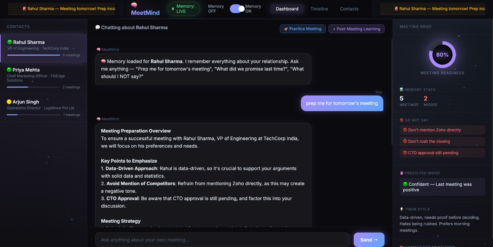

# 🧠 MeetMind

MeetMind is an AI meeting intelligence agent that helps you prepare for meetings by remembering past conversations, missed follow-ups, client preferences, sensitive topics, and relationship history.

Most meeting assistants summarize what happened.  
MeetMind helps you prepare for what happens next.



---

## ✨ Features

- 🧠 **Persistent memory** using Hindsight — remembers every contact across sessions
- 🔁 **Memory ON/OFF mode** — compare generic vs memory-backed responses live
- 📋 **Meeting brief** with readiness score, warnings, mood, and competitor context
- 🚫 **Do-not-say warnings** for sensitive meeting topics
- 🕐 **Memory timeline** of previous interactions
- 📝 **Post-meeting learning** to save new outcomes after every call
- 🎯 **Practice mode** with client roleplay and scorecard feedback

---

## 🛠️ Tech Stack

| Layer | Technology |
|-------|-----------|
| Frontend | HTML, CSS, JavaScript |
| Backend | Python, Flask, Flask-CORS |
| LLM | Groq (llama-3.3-70b-versatile) |
| Memory | Hindsight by Vectorize |

---

## 📁 Project Structure

```
meetmind-agent/
├── backend/
│   ├── app.py                 # Flask API routes
│   ├── data.py                # Contact and meeting data
│   └── hindsight_memory.py    # Hindsight retain/recall functions
├── frontend/
│   ├── index.html             # Main UI
│   ├── style.css              # Styling
│   └── script.js              # Frontend logic
└── README.md
```

---

## ⚙️ Setup & Installation

### Prerequisites

- Python 3.8+
- A [Groq API key](https://groq.com/) (free tier available)
- A [Hindsight API key](https://ui.hindsight.vectorize.io/) (use promo code `MEMHACK6` for $50 free credits)

### 1. Clone the repository

```bash
git clone https://github.com/sherinjasoria/meetmind-agent.git
cd meetmind-agent
```

### 2. Install dependencies

```bash
pip install flask flask-cors groq python-dotenv requests
```

### 3. Set up environment variables

Create a `.env` file in the `backend/` folder:

```
GROQ_API_KEY=your_groq_api_key_here
HINDSIGHT_API_KEY=your_hindsight_api_key_here
```

### 4. Run the backend

```bash
cd backend
python app.py
```

The server will start on `http://localhost:5001` and automatically load all contact history into Hindsight memory.

### 5. Open the frontend

Open `frontend/index.html` in your browser directly, or serve it with:

```bash
cd frontend
python -m http.server 3000
```

Then visit `http://localhost:3000`

---

## 🔑 Environment Variables

| Variable | Description |
|----------|-------------|
| `GROQ_API_KEY` | Your Groq API key for LLM inference |
| `HINDSIGHT_API_KEY` | Your Hindsight API key for persistent memory |

---

## ✏️ Example

Ask MeetMind:

> "Prep me for Rahul's meeting."

**With memory OFF** → generic advice: review agenda, set goals, ask good questions.

**With memory ON** → specific intelligence:
- Don't mention Zoho directly
- Don't rush the closing — CTO approval is still pending
- Legal flagged two clauses on the contract
- Revised contract was promised by May 25
- Rahul is data-driven — bring proof, not opinions

---

## 🔗 Hindsight

MeetMind uses [Hindsight](https://github.com/vectorize-io/hindsight) to retain and recall meeting memories across sessions.

Unlike temporary chat history, Hindsight persists context between conversations and retrieves memories semantically — so when you ask "what did I promise last time?", it returns what's relevant, not everything ever stored.

- [Hindsight GitHub](https://github.com/vectorize-io/hindsight)
- [Hindsight Docs](https://hindsight.vectorize.io/)
- [Agent Memory by Vectorize](https://vectorize.io/what-is-agent-memory)

---

## 💡 Why MeetMind

MeetMind is built around one idea:

> A meeting assistant should not just remember what happened.  
> It should help you walk into the next meeting better prepared.

Every call with a client adds a layer. After five conversations with Rahul, the agent knows his legal concerns, approval blockers, preferred pace, and the one competitor you should never mention in the room.

That is the kind of memory that changes outcomes.

---

## 👥 Team

Built by [Sherin Jasoria](https://github.com/sherinjasoria) & Aarushi Dutt
